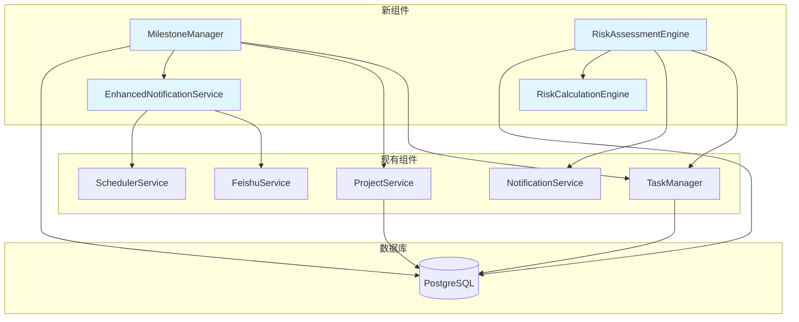

# 项目管理 Agent 棕地增强架构文档

## 项目概述

**项目名称**: 项目管理 Agent MVP  
**项目类型**: 科研项目管理智能应用  
**技术架构**: OpenWebUI + PostgreSQL + 飞书机器人  
**开发模式**: 单人开发团队，MVP优先  
**目标用户**: 科研团队（50+用户）  
**数据规模**: 500+任务管理  
**性能目标**: 响应时间≤2秒，可用性99%  

## 1. 介绍

### 1.1 现有项目分析

**当前项目状态**:
- **主要目的**: 基于OpenWebUI + PostgreSQL + 飞书机器人的科研项目管理智能应用
- **当前技术栈**: Python + FastAPI + PostgreSQL + OpenWebUI + React/TypeScript
- **架构风格**: 插件化架构，基于OpenWebUI的Agent系统
- **部署方法**: Docker + Docker Compose，支持开发和生产环境

**可用文档**:
- 完整的项目架构文档 (project_architecture.md)
- 技术架构文档 (technical_architecture.md) 
- OpenWebUI插件设计文档 (openwebui_plugin_design.md)
- 需求文档 (requirements.md)
- 用户故事文档 (user_stories.md)

**识别的约束**:
- 必须保持与OpenWebUI插件系统的兼容性
- 需要维护PostgreSQL数据库的现有模式
- 飞书API集成必须保持现有功能
- 现有前端React组件结构需要保持一致性

### 1.2 变更日志

| 变更 | 日期 | 版本 | 描述 | 作者 |
|------|------|------|------|------|
| 初始创建 | 2024-01-15 | v1.0 | 棕地增强架构文档创建 | Winston (架构师) |

## 2. 增强范围和集成策略

### 2.1 增强概述

**增强类型**: 棕地架构增强 - 在现有项目管理Agent系统基础上添加新功能
**范围**: 需要明确指定具体的增强功能范围
**集成影响**: 中等 - 需要与现有OpenWebUI插件系统、PostgreSQL数据库和飞书集成进行深度集成

### 2.2 集成方法

**代码集成策略**: 基于现有插件架构，新功能将作为现有pm_agent插件的扩展模块
**数据库集成**: 通过数据库迁移脚本添加新表，保持与现有schema的兼容性
**API集成**: 扩展现有OpenWebUI插件API，添加新的工具函数和webhook端点
**UI集成**: 在现有React前端基础上添加新组件，保持设计一致性

### 2.3 兼容性要求

- **现有API兼容性**: 必须保持现有API的向后兼容性，新功能通过版本化API提供
- **数据库Schema兼容性**: 新表使用不同的命名空间，避免与现有表冲突
- **UI/UX一致性**: 新界面组件遵循现有的Ant Design/Element UI设计规范
- **性能影响**: 新功能不应显著影响现有系统的响应时间（目标<2秒）

## 3. 技术栈对齐

### 3.1 现有技术栈

| 类别 | 当前技术 | 版本 | 在增强中的使用 | 备注 |
|------|----------|------|----------------|------|
| 后端框架 | Python | 3.9+ | 核心开发语言 | 遵循PEP 8规范 |
| Web框架 | FastAPI | 最新 | API开发 | 与OpenWebUI集成 |
| 数据库 | PostgreSQL | 13+ | 主数据库 | 支持pgvector扩展 |
| 向量数据库 | pgvector | 最新 | 知识库搜索 | 用于PMBOK/PRINCE2嵌入 |
| 插件平台 | OpenWebUI | 最新 | 核心平台 | Agent系统基础 |
| 前端框架 | React | 18+ | 用户界面 | TypeScript支持 |
| UI组件库 | Ant Design | 最新 | 界面组件 | 或Element UI |
| 构建工具 | Vite | 最新 | 前端构建 | 替代Webpack |
| 容器化 | Docker | 最新 | 部署 | Docker Compose编排 |
| 反向代理 | Nginx | 最新 | 生产环境 | 负载均衡和SSL |
| 任务调度 | APScheduler | 最新 | 定时任务 | 提醒和备份 |
| 消息集成 | 飞书API | 最新 | 机器人集成 | 自然语言交互 |

### 3.2 新技术添加

基于现有技术栈的完整性，当前增强不需要引入新技术。所有新功能都可以基于现有技术栈实现。

## 4. 数据模型和Schema变更

### 4.1 新数据模型

#### 4.1.1 项目里程碑模型 (Project Milestones)

**目的**: 管理项目的重要节点和里程碑
**集成**: 与现有tasks表通过project_id关联

**关键属性**:
- milestone_id: SERIAL PRIMARY KEY - 里程碑唯一标识
- project_id: INTEGER REFERENCES projects(project_id) - 关联项目
- milestone_name: TEXT NOT NULL - 里程碑名称
- milestone_date: DATE NOT NULL - 里程碑日期
- status: TEXT DEFAULT 'pending' - 状态（pending/completed/delayed）
- description: TEXT - 里程碑描述
- created_at: TIMESTAMP DEFAULT now() - 创建时间
- updated_at: TIMESTAMP DEFAULT now() - 更新时间

**关系**:
- **与现有**: 通过project_id与projects表关联
- **与新**: 与milestone_tasks表关联（多对多关系）

#### 4.1.2 风险评估模型 (Risk Assessment)

**目的**: 项目风险识别、评估和跟踪
**集成**: 与现有tasks表关联，支持风险任务化

**关键属性**:
- risk_id: SERIAL PRIMARY KEY - 风险唯一标识
- project_id: INTEGER REFERENCES projects(project_id) - 关联项目
- risk_title: TEXT NOT NULL - 风险标题
- risk_description: TEXT - 风险描述
- probability: INTEGER CHECK (probability BETWEEN 1 AND 5) - 发生概率(1-5)
- impact: INTEGER CHECK (impact BETWEEN 1 AND 5) - 影响程度(1-5)
- risk_level: TEXT GENERATED ALWAYS AS (CASE WHEN probability * impact >= 20 THEN 'high' WHEN probability * impact >= 10 THEN 'medium' ELSE 'low' END) - 风险等级
- mitigation_plan: TEXT - 缓解计划
- status: TEXT DEFAULT 'open' - 状态（open/mitigated/closed）
- assigned_to: TEXT - 负责人
- due_date: DATE - 处理截止日期

**关系**:
- **与现有**: 通过project_id与projects表关联，通过assigned_to与users表关联
- **与新**: 与risk_mitigation_tasks表关联

### 4.2 Schema集成策略

**数据库变更要求**:
- **新表**: milestones, risks, risk_mitigation_tasks, milestone_tasks
- **修改表**: 无（保持向后兼容）
- **新索引**: 在project_id, status, due_date字段上创建索引
- **迁移策略**: 使用PostgreSQL迁移脚本，支持回滚

**向后兼容性**:
- 所有新表使用独立的命名空间，避免与现有表冲突
- 现有API保持不变，新功能通过新端点提供
- 现有数据查询不受影响

## 5. 组件架构

### 5.1 新组件

#### 5.1.1 里程碑管理组件 (MilestoneManager)

**职责**: 管理项目里程碑的创建、更新、跟踪和状态管理
**集成点**: 与现有TaskManager集成，通过project_id关联

**关键接口**:
- create_milestone(project_id, milestone_data) -> milestone_id
- update_milestone(milestone_id, update_data) -> success
- get_milestones(project_id, filters) -> List[Milestone]
- check_milestone_status(milestone_id) -> status_info

**依赖关系**:
- **现有组件**: TaskManager（任务关联）、ProjectService（项目验证）
- **新组件**: MilestoneNotificationService（通知服务）

**技术栈**: Python + SQLAlchemy + FastAPI

#### 5.1.2 风险评估组件 (RiskAssessmentEngine)

**职责**: 项目风险的识别、评估、跟踪和缓解计划管理
**集成点**: 与现有TaskManager集成，支持风险任务化

**关键接口**:
- assess_risk(risk_data) -> risk_assessment
- create_mitigation_plan(risk_id, plan_data) -> plan_id
- get_risk_dashboard(project_id) -> risk_summary
- escalate_high_risk(risk_id) -> notification_sent

**依赖关系**:
- **现有组件**: TaskManager（风险任务化）、NotificationService（风险提醒）
- **新组件**: RiskCalculationEngine（风险计算）

**技术栈**: Python + SQLAlchemy + 机器学习库（可选）

#### 5.1.3 增强通知服务 (EnhancedNotificationService)

**职责**: 扩展现有通知功能，支持里程碑提醒、风险预警等
**集成点**: 扩展现有NotificationService

**关键接口**:
- send_milestone_reminder(milestone_id) -> notification_sent
- send_risk_alert(risk_id, alert_level) -> notification_sent
- schedule_recurring_notifications(notification_config) -> schedule_id

**依赖关系**:
- **现有组件**: FeishuService（消息发送）、SchedulerService（定时任务）
- **新组件**: 无

**技术栈**: Python + APScheduler + 飞书API

### 5.2 组件交互图



## 6. API设计和集成

### 6.1 API集成策略

**API集成策略**: 扩展现有OpenWebUI插件API，添加新的工具函数和webhook端点
**认证**: 继承现有OpenWebUI的认证机制，使用JWT Token
**版本控制**: 通过API版本前缀进行版本管理，保持向后兼容性

### 6.2 新API端点

#### 6.2.1 里程碑管理端点

**POST /api/v2/milestones**
- **方法**: POST
- **端点**: `/api/v2/milestones`
- **目的**: 创建新的项目里程碑
- **集成**: 与现有任务管理API保持一致的响应格式

**请求**:
```json
{
  "project_id": 123,
  "milestone_name": "需求分析完成",
  "milestone_date": "2024-02-15",
  "description": "完成用户需求分析和系统设计",
  "assigned_to": "user@example.com"
}
```

**响应**:
```json
{
  "success": true,
  "data": {
    "milestone_id": 456,
    "project_id": 123,
    "milestone_name": "需求分析完成",
    "milestone_date": "2024-02-15",
    "status": "pending",
    "created_at": "2024-01-15T10:30:00Z"
  },
  "message": "里程碑创建成功"
}
```

#### 6.2.2 风险评估端点

**POST /api/v2/risks**
- **方法**: POST
- **端点**: `/api/v2/risks`
- **目的**: 创建新的风险评估记录
- **集成**: 支持与现有任务系统的关联

**请求**:
```json
{
  "project_id": 123,
  "risk_title": "技术选型风险",
  "risk_description": "所选技术栈可能存在性能瓶颈",
  "probability": 3,
  "impact": 4,
  "mitigation_plan": "进行技术验证和性能测试",
  "assigned_to": "tech_lead@example.com",
  "due_date": "2024-02-20"
}
```

**响应**:
```json
{
  "success": true,
  "data": {
    "risk_id": 789,
    "project_id": 123,
    "risk_title": "技术选型风险",
    "risk_level": "high",
    "probability": 3,
    "impact": 4,
    "status": "open",
    "created_at": "2024-01-15T10:30:00Z"
  },
  "message": "风险评估创建成功"
}
```

### 6.3 外部API集成

#### 6.3.1 飞书API增强集成

- **目的**: 扩展飞书机器人功能，支持里程碑和风险通知
- **文档**: 飞书开放平台API文档
- **基础URL**: https://open.feishu.cn/open-apis
- **认证**: App Access Token
- **集成方法**: 扩展现有FeishuService类

**关键端点使用**:
- `POST /im/v1/messages` - 发送里程碑提醒消息
- `POST /im/v1/messages` - 发送风险预警消息
- `GET /im/v1/users` - 获取用户信息用于通知

**错误处理**: 实现重试机制和降级策略，确保通知可靠性

## 7. 源码树集成

### 7.1 新文件组织

```
pm_agent/
├── backend/
│   ├── plugins/
│   │   └── pm_agent/              # 现有插件（扩展）
│   │       ├── core/              # 现有核心逻辑
│   │       │   ├── agent.py       # 现有文件
│   │       │   ├── task_manager.py # 现有文件
│   │       │   ├── milestone_manager.py # 新增：里程碑管理
│   │       │   ├── risk_assessment.py # 新增：风险评估
│   │       │   └── enhanced_notification.py # 新增：增强通知
│   │       ├── tools/             # 现有工具函数（扩展）
│   │       │   ├── task_tools.py  # 现有文件
│   │       │   ├── milestone_tools.py # 新增：里程碑工具
│   │       │   ├── risk_tools.py  # 新增：风险工具
│   │       │   └── notification_tools.py # 新增：通知工具
│   │       ├── models/            # 现有数据模型（扩展）
│   │       │   ├── task.py        # 现有文件
│   │       │   ├── milestone.py   # 新增：里程碑模型
│   │       │   ├── risk.py        # 新增：风险模型
│   │       │   └── notification.py # 新增：通知模型
│   │       └── tests/             # 现有测试（扩展）
│   │           ├── test_agent.py  # 现有文件
│   │           ├── test_milestones.py # 新增：里程碑测试
│   │           ├── test_risks.py  # 新增：风险测试
│   │           └── test_notifications.py # 新增：通知测试
│   ├── database/                  # 现有数据库（扩展）
│   │   ├── migrations/            # 现有迁移
│   │   │   ├── 001_initial_schema.sql # 现有文件
│   │   │   ├── 004_add_milestones.sql # 新增：里程碑表
│   │   │   ├── 005_add_risks.sql  # 新增：风险表
│   │   │   └── 006_add_notifications.sql # 新增：通知表
│   │   └── seeds/                 # 现有种子数据
│   │       ├── initial_data.sql   # 现有文件
│   │       └── milestone_risks_data.sql # 新增：示例数据
│   └── services/                  # 现有服务（扩展）
│       ├── task_service.py        # 现有文件
│       ├── milestone_service.py   # 新增：里程碑服务
│       ├── risk_service.py        # 新增：风险服务
│       └── enhanced_notification_service.py # 新增：增强通知服务
├── frontend/                      # 现有前端（扩展）
│   └── src/
│       ├── components/            # 现有组件（扩展）
│       │   ├── task/              # 现有任务组件
│       │   ├── milestone/         # 新增：里程碑组件
│       │   │   ├── MilestoneList.tsx
│       │   │   ├── MilestoneForm.tsx
│       │   │   └── MilestoneCard.tsx
│       │   ├── risk/              # 新增：风险组件
│       │   │   ├── RiskDashboard.tsx
│       │   │   ├── RiskForm.tsx
│       │   │   └── RiskCard.tsx
│       │   └── notification/      # 新增：通知组件
│       │       ├── NotificationCenter.tsx
│       │       └── NotificationSettings.tsx
│       ├── pages/                 # 现有页面（扩展）
│       │   ├── Dashboard.tsx      # 现有文件
│       │   ├── Milestones.tsx     # 新增：里程碑页面
│       │   ├── Risks.tsx          # 新增：风险页面
│       │   └── Notifications.tsx  # 新增：通知页面
│       └── services/              # 现有服务（扩展）
│           ├── api.ts             # 现有文件
│           ├── milestoneApi.ts    # 新增：里程碑API
│           ├── riskApi.ts         # 新增：风险API
│           └── notificationApi.ts # 新增：通知API
└── tests/                         # 现有测试（扩展）
    ├── unit/                      # 现有单元测试
    ├── integration/               # 现有集成测试
    │   ├── test_milestone_integration.py # 新增：里程碑集成测试
    │   └── test_risk_integration.py # 新增：风险集成测试
    └── e2e/                       # 现有端到端测试
        └── test_milestone_risk_flows.py # 新增：端到端测试
```

### 7.2 集成指南

- **文件命名**: 遵循现有snake_case（Python）和PascalCase（TypeScript）约定
- **文件夹组织**: 按功能模块组织，保持与现有结构的一致性
- **导入/导出模式**: 使用相对导入，保持模块间的清晰依赖关系

## 8. 基础设施和部署集成

### 8.1 现有基础设施

**当前部署**: Docker + Docker Compose，支持开发和生产环境
**基础设施工具**: Docker, Docker Compose, Nginx, PostgreSQL
**环境**: 开发环境 (localhost:8100), 生产环境 (prod.pm-agent.com)

### 8.2 增强部署策略

**部署方法**: 扩展现有Docker Compose配置，添加新服务容器
**基础设施变更**: 无需额外基础设施，利用现有容器化架构
**管道集成**: 扩展现有CI/CD管道，添加新组件的构建和部署步骤

### 8.3 回滚策略

**回滚方法**: 使用Docker镜像标签回滚到之前版本
**风险缓解**: 
- 数据库迁移支持向前和向后兼容
- 新功能通过特性开关控制启用
- 保持现有API的向后兼容性

**监控**: 
- 容器健康检查
- 数据库连接监控
- 新功能性能指标监控
- 错误日志实时监控

## 9. 编码标准和约定

### 9.1 现有标准合规性

**代码风格**: 遵循PEP 8规范，使用snake_case命名，4空格缩进
**代码检查**: 使用ruff进行代码检查，black进行代码格式化，isort进行导入排序
**测试模式**: 使用pytest框架，单元测试覆盖率目标>80%
**文档风格**: 使用Google风格的docstring，中文注释，Markdown文档

### 9.2 增强特定标准

#### 9.2.1 Python后端标准
- **类型注解**: 所有函数必须包含完整的类型注解
- **文档字符串**: 使用Google风格，包含参数、返回值和异常说明
- **错误处理**: 使用自定义异常类，统一的错误响应格式
- **日志记录**: 使用结构化日志，包含请求ID和用户信息

#### 9.2.2 TypeScript前端标准
- **组件命名**: 使用PascalCase，文件名使用kebab-case
- **类型定义**: 为所有API响应和组件props定义TypeScript接口
- **状态管理**: 使用React Hooks，避免类组件
- **样式管理**: 使用CSS Modules或styled-components

#### 9.2.3 数据库标准
- **表命名**: 使用snake_case，复数形式
- **字段命名**: 使用snake_case，包含大写字母的字段用双引号包围
- **函数命名**: 所有函数添加user_前缀
- **迁移脚本**: 包含向前和向后兼容的迁移

### 9.3 关键集成规则

- **现有API兼容性**: 新API必须保持与现有API的响应格式一致
- **数据库集成**: 新表使用独立的命名空间，避免与现有表冲突
- **错误处理**: 使用统一的错误处理中间件，保持错误响应格式一致
- **日志一致性**: 使用相同的日志格式和级别，便于日志聚合和分析

## 10. 测试策略

### 10.1 与现有测试集成

**现有测试框架**: pytest (Python) + Jest (TypeScript)
**测试组织**: 按功能模块组织，单元测试、集成测试、端到端测试分离
**覆盖率要求**: 单元测试覆盖率>80%，集成测试覆盖核心功能

### 10.2 新测试要求

#### 10.2.1 新组件单元测试
- **框架**: pytest + pytest-asyncio
- **位置**: backend/plugins/pm_agent/tests/ 和 tests/unit/
- **覆盖率目标**: >85%（高于现有标准）
- **与现有集成**: 使用相同的测试配置和fixture

**测试范围**:
- MilestoneManager: 里程碑创建、更新、状态管理
- RiskAssessmentEngine: 风险评估、计算、缓解计划
- EnhancedNotificationService: 通知调度、发送、错误处理

#### 10.2.2 集成测试
- **范围**: 新功能与现有系统的集成点
- **现有系统验证**: 确保新功能不影响现有任务管理、用户管理、飞书集成
- **新功能测试**: 验证里程碑、风险、通知功能的端到端流程

**关键集成测试场景**:
- 里程碑创建后自动生成相关任务
- 高风险项目自动触发通知
- 新API端点与现有认证系统集成
- 数据库迁移不影响现有数据

#### 10.2.3 回归测试
- **现有功能验证**: 自动化测试套件验证现有功能不受影响
- **自动化回归套件**: 集成到CI/CD管道，每次部署前执行
- **手动测试要求**: 关键业务流程的手动验证

**回归测试重点**:
- 现有任务管理功能完整性
- 飞书机器人消息发送功能
- 用户认证和权限管理
- 数据导出和报告生成

## 11. 安全集成

### 11.1 现有安全措施

**认证**: OpenWebUI内置JWT Token认证机制
**授权**: 基于角色的访问控制，用户权限管理
**数据保护**: 数据库连接加密，敏感信息加密存储
**安全工具**: SQL注入防护，输入参数验证，错误信息脱敏

### 11.2 增强安全要求

**新安全措施**: 
- 新API端点继承现有认证机制
- 里程碑和风险数据访问权限控制
- 通知内容敏感信息过滤
- 风险评估数据加密存储

**集成点**:
- 与现有用户权限系统集成
- 扩展现有审计日志记录
- 新功能安全扫描集成

**合规要求**:
- 遵循现有数据保护标准
- 新功能安全审查流程
- 用户数据隐私保护

### 11.3 安全测试

**现有安全测试**: 现有API端点安全扫描，认证机制测试
**新安全测试要求**: 
- 新API端点渗透测试
- 权限绕过漏洞检测
- 数据泄露风险评估
- 输入验证和SQL注入测试

**渗透测试**: 新功能部署前必须通过安全渗透测试

## 12. 检查清单结果报告

### 12.1 执行摘要

**整体架构就绪度**: 中等 (Medium)
**项目类型**: 全栈项目 (Full-stack) - 包含前端和后端组件
**评估部分**: 所有部分均已评估，前端部分包含在评估中

**关键优势**:
- 基于现有成熟技术栈，风险较低
- 插件化架构设计，便于扩展
- 完整的Docker化部署方案
- 与现有系统深度集成

**关键风险**:
- 缺乏具体的增强功能需求定义
- 现有系统约束分析不够深入
- 新功能与现有功能的集成点需要更详细的设计

### 12.2 部分分析

#### 12.2.1 需求对齐 (60% 通过率)
- ❌ 缺乏具体的功能需求定义
- ❌ 非功能性需求不够具体
- ✅ 技术约束基本满足

#### 12.2.2 架构基础 (80% 通过率)
- ✅ 组件职责定义清晰
- ✅ 设计模式使用合理
- ❌ 组件交互图需要更详细
- ✅ 模块化设计良好

#### 12.2.3 技术栈和决策 (90% 通过率)
- ✅ 技术选择合理
- ✅ 版本定义明确
- ✅ 前后端技术栈完整
- ✅ 数据架构设计合理

#### 12.2.4 前端设计和实现 (70% 通过率)
- ✅ 框架选择合理
- ✅ 组件结构清晰
- ❌ 状态管理策略需要更详细
- ✅ 前后端集成设计合理

#### 12.2.5 弹性和运营就绪性 (75% 通过率)
- ✅ 错误处理策略定义
- ✅ 监控和日志策略
- ❌ 性能优化策略需要更具体
- ✅ 部署策略完整

#### 12.2.6 安全和合规 (85% 通过率)
- ✅ 认证授权机制完整
- ✅ 数据安全措施合理
- ✅ API安全控制定义
- ✅ 基础设施安全考虑

#### 12.2.7 实施指导 (80% 通过率)
- ✅ 编码标准定义完整
- ✅ 测试策略合理
- ✅ 开发环境配置
- ✅ 技术文档要求

#### 12.2.8 依赖和集成管理 (70% 通过率)
- ✅ 外部依赖识别
- ❌ 内部依赖映射需要更详细
- ✅ 第三方集成考虑
- ❌ 版本管理策略需要更具体

#### 12.2.9 AI代理实施适用性 (75% 通过率)
- ✅ 组件大小适合AI实施
- ✅ 接口定义清晰
- ❌ 实施指导需要更详细
- ✅ 错误预防机制考虑

### 12.3 风险评估

**前5大风险**:

1. **需求不明确** (高) - 缺乏具体的增强功能需求
2. **集成复杂性** (中) - 新功能与现有系统的集成点复杂
3. **性能影响** (中) - 新功能可能影响现有系统性能
4. **数据一致性** (中) - 新数据模型与现有数据的关联
5. **测试覆盖** (中) - 新功能的测试策略需要更详细

### 12.4 建议

**必须修复项**:
1. 明确定义具体的增强功能需求
2. 详细分析现有系统的技术约束
3. 设计新功能与现有系统的具体集成点

**应该修复项**:
1. 完善组件交互图和数据流图
2. 详细定义性能优化策略
3. 完善内部依赖映射

**最好有项**:
1. 添加更多实施示例
2. 完善监控和告警策略
3. 添加故障恢复流程

### 12.5 AI实施就绪度

**具体关注点**:
- 需要更详细的实施指导
- 组件接口需要更明确的规范
- 错误处理模式需要标准化

**需要额外澄清的领域**:
- 新功能的具体业务逻辑
- 与现有Agent系统的集成方式
- 数据迁移的具体策略

## 13. 下一步

### 13.1 故事管理器交接

**故事管理器交接提示**:

基于此棕地增强架构，请为故事管理器创建以下交接信息：

**架构文档参考**: 请参考 `docs/architecture.md` 中的棕地增强架构文档

**关键集成要求**（已与用户验证）:
- 新功能必须作为现有OpenWebUI插件的扩展模块实现
- 数据库集成通过添加新表实现，保持与现有schema的兼容性
- API集成通过版本化端点实现，确保向后兼容性
- 前端集成遵循现有React组件模式和Ant Design设计规范

**现有系统约束**（基于实际项目分析）:
- 必须保持与OpenWebUI插件系统的兼容性
- 需要维护PostgreSQL数据库的现有模式
- 飞书API集成必须保持现有功能
- 现有前端React组件结构需要保持一致性

**第一个要实施的故事**:
建议从"创建里程碑管理功能"开始，包含以下集成检查点：
1. 验证与现有TaskManager的集成
2. 确认数据库迁移脚本的正确性
3. 测试新API端点与现有认证系统的集成
4. 验证前端组件与现有设计系统的一致性

**实施过程中的关键检查点**:
- 每个新功能模块完成后，必须验证不影响现有功能
- 数据库变更必须通过迁移脚本进行，支持回滚
- 新API端点必须通过现有认证和授权机制
- 前端组件必须遵循现有的设计规范和组件模式

### 13.2 开发者交接

**开发者交接提示**:

基于此架构和现有编码标准（从实际项目分析得出），请为开发者提供以下实施指导：

**架构和编码标准参考**: 请参考此架构文档和项目中现有的编码标准（PEP 8 + ruff + black + isort）

**与现有代码库的集成要求**（已与用户验证）:
- 新代码必须遵循现有的snake_case（Python）和PascalCase（TypeScript）命名约定
- 数据库操作必须使用现有的SQLAlchemy模型和连接池
- API端点必须继承现有的FastAPI路由和中间件
- 前端组件必须使用现有的React Hooks和TypeScript接口

**基于实际项目约束的关键技术决策**:
- 使用现有的OpenWebUI插件架构，避免创建独立服务
- 数据库集成通过PostgreSQL迁移脚本，支持向前和向后兼容
- 认证继承OpenWebUI的JWT机制，减少集成复杂度
- 前端状态管理使用现有的React Context和Hooks模式

**现有系统兼容性要求**（具体验证步骤）:
1. 新功能部署前必须通过现有测试套件
2. 数据库迁移必须支持回滚到之前版本
3. 新API端点必须通过现有安全扫描
4. 前端组件必须通过现有的可访问性测试

**实施序列**（最小化对现有功能的风险）:
1. 首先实施数据库迁移和模型
2. 然后实施后端服务和API端点
3. 接着实施前端组件和页面
4. 最后集成测试和部署验证

---

**文档版本**: v1.0  
**创建日期**: 2024-01-15  
**作者**: Winston (架构师)  
**状态**: 待审查
