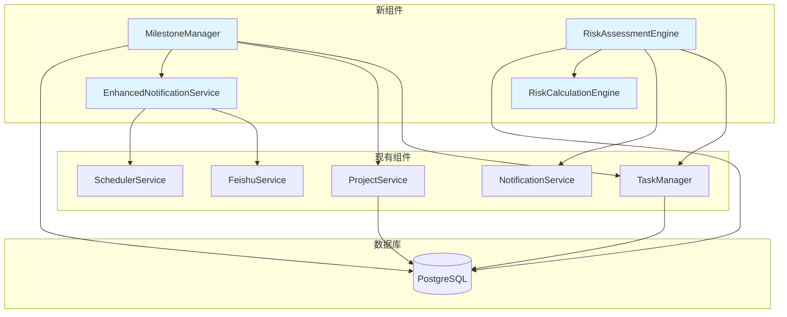

# 5. 组件架构

### 5.1 新组件

#### 5.1.1 里程碑管理组件 (MilestoneManager)

**职责**: 管理项目里程碑的创建、更新、跟踪和状态管理
**集成点**: 与现有TaskManager集成，通过project_id关联

**关键接口**:
- create_milestone(project_id, milestone_data) -> milestone_id
- update_milestone(milestone_id, update_data) -> success
- get_milestones(project_id, filters) -> List[Milestone]
- check_milestone_status(milestone_id) -> status_info

**依赖关系**:
- **现有组件**: TaskManager（任务关联）、ProjectService（项目验证）
- **新组件**: MilestoneNotificationService（通知服务）

**技术栈**: Python + SQLAlchemy + FastAPI

#### 5.1.2 风险评估组件 (RiskAssessmentEngine)

**职责**: 项目风险的识别、评估、跟踪和缓解计划管理
**集成点**: 与现有TaskManager集成，支持风险任务化

**关键接口**:
- assess_risk(risk_data) -> risk_assessment
- create_mitigation_plan(risk_id, plan_data) -> plan_id
- get_risk_dashboard(project_id) -> risk_summary
- escalate_high_risk(risk_id) -> notification_sent

**依赖关系**:
- **现有组件**: TaskManager（风险任务化）、NotificationService（风险提醒）
- **新组件**: RiskCalculationEngine（风险计算）

**技术栈**: Python + SQLAlchemy + 机器学习库（可选）

#### 5.1.3 增强通知服务 (EnhancedNotificationService)

**职责**: 扩展现有通知功能，支持里程碑提醒、风险预警等
**集成点**: 扩展现有NotificationService

**关键接口**:
- send_milestone_reminder(milestone_id) -> notification_sent
- send_risk_alert(risk_id, alert_level) -> notification_sent
- schedule_recurring_notifications(notification_config) -> schedule_id

**依赖关系**:
- **现有组件**: FeishuService（消息发送）、SchedulerService（定时任务）
- **新组件**: 无

**技术栈**: Python + APScheduler + 飞书API

### 5.2 组件交互图


